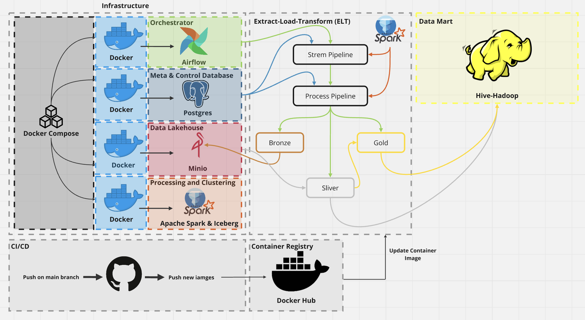

# Services Use

# Set up environment before process
## Set up Oracle Database (PDB) for macos
   -  https://www.youtube.com/watch?v=uxvoMhkKUPE

## Dockerfile setup
   -  docker build -t tabulario/spark-iceberg:latest .

# Reference
Ref for stylish design : 
   - https://www.reddit.com/r/dataengineering/comments/124wcjb/my_3rd_data_project_with_airflow_docker_postgres/

Ref for iceberg OTFs annd minio docker-compose file:
   - https://blog.min.io/a-developers-introduction-to-apache-iceberg-using-minio/