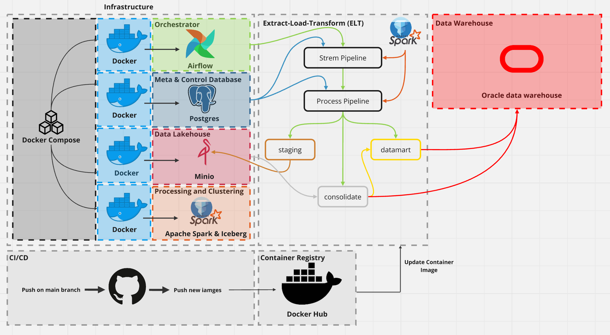

# Services Use

# Set up environment before process
## Set up Oracle Database (PDB) for macos
   -  https://www.youtube.com/watch?v=uxvoMhkKUPE
   -  problem with restricted mode run as follow (optional)
      - docker exec -it oracle19 bash
      - sqlplus sys/mypassword1@localhost:1521/ORCLCDB AS SYSDBA
      - ALTER SYSTEM DISABLE RESTRICTED SESSION;
      - ctrl + D to exit sql mode, same with bash mode
   - grant privilege
      `GRANT UNLIMITED TABLESPACE TO sys`
      
   ***Note: you need to wait for few minute(up to 5 minutes for CDB mode and 8 minutes for PDB mode) to let the oracle finished it initialization and leave restrict mode, then you will fully connect to the database***

## Dockerfile setup
   -  docker build -t tabulario/spark-iceberg:latest .   

# Reference
Ref for stylish design : 
   - https://www.reddit.com/r/dataengineering/comments/124wcjb/my_3rd_data_project_with_airflow_docker_postgres/

Ref for iceberg OTFs annd minio docker-compose file:
   - https://blog.min.io/a-developers-introduction-to-apache-iceberg-using-minio/